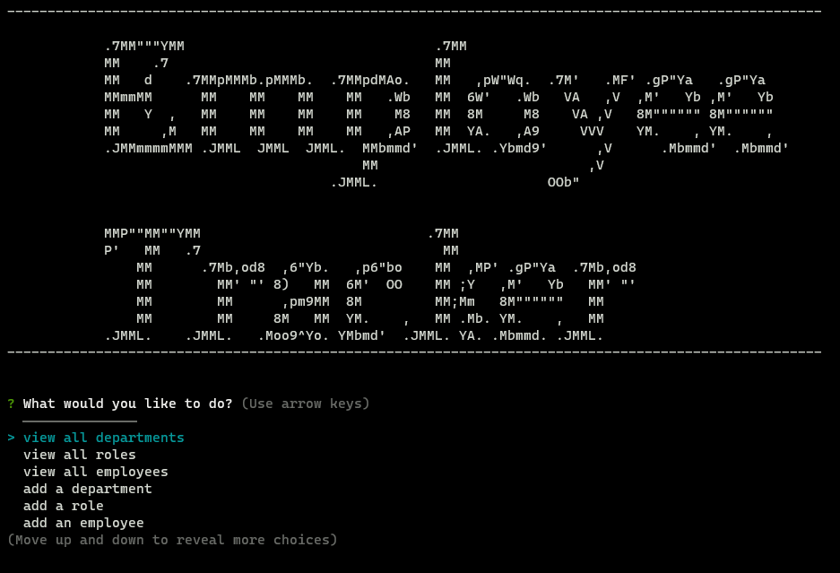

# CWRU Bootcamp Challenge 12 - Employee Tracker

    
## Description
    
### The goal of this project was to create a program that could display, add and update a theoretical company database using a command-line interface!
### Behind the scenes, this program heavily relies on MySQL, and the following packages: inquirer, to prompt the user, and MySQL2, to integrate and talk to MySQL databases!
### This assignment was very difficult for me, but I managed to get through! The syntax for MySQL is very particular and learning the ins and outs of it took some extra research.

## Table of Contents

- [Installation](#installation)
- [Usage](#usage)
- [Video](#video)
- [Mockup](#mockup)
- [Contrubuting](#contributing)
- [License](#license)
- [Contact Me](#questions)

## Installation

Simply download the files, run 'npm install' to get the required packages! 
Afterwards, either create a 'company_db' with your own schema or just run both of my schema files with the 'source' command in MySQL!

## Usage

After doing the procedure done during installation, just run 'node index' in the command line within the folder and follow the prompts given! 
Note: You may need to update the code at the very top of the page for your specific MySQL password information for your root user!

## Video

### Here is a link to the video example showcasing the installation and usage of this project:

## Mockup

    

## Contributing

Feel free to fork this repo if you have anything you want to add, change, or remove in regards to this project. I love feedback!

## License

The license used in this project was the MIT license! Please reference the LICENSE file inside of the repository.

## Questions?

You can find me here on GitHub at https://www.github.com/Anthony-GG

Otherwise, feel free to reach me at anthony@vayneglory.com

---